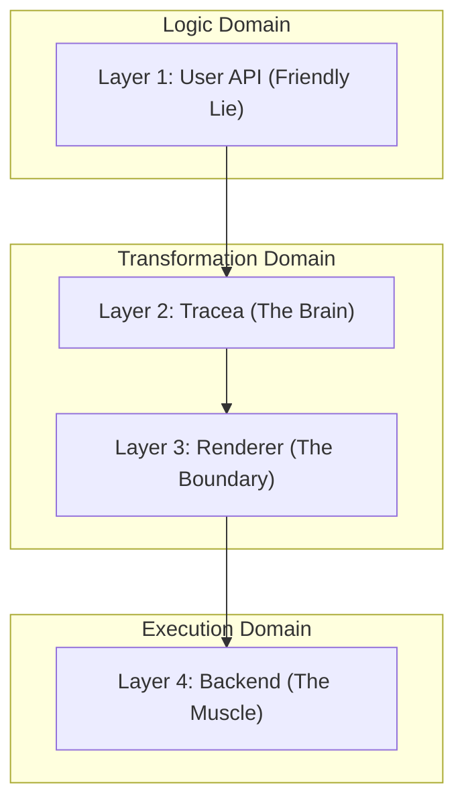

# Architecture: The Dual-Persona Design

Fantasmagorie follows a strict layered architecture designed to isolate user-facing logic from GPU-specific optimizations.

## The Four Layers

### 1. User API (The Friendly Lie)
Located in `src/widgets`, `src/game/sprite.rs`.
Developers interact with **Builders**. These aren't the actual engine objects; they are high-level descriptions of intent. They allow for a clean, readable syntax that feels like writing UI or game logic without worrying about the underlying complexity.

### 2. Tracea (The Brain)
Located in `src/tracea`.
Tracea interprets the "Lie" told by the User API. It optimizes the draw commands, handles compute-based effects (like JFA), and decides how to translate abstract shapes into GPU-executable instructions.

### 3. Renderer (The Boundary)
Located in `src/renderer`.
Under the **V5 Crystal** architecture, the Renderer is simplified. It uses the `RenderOrchestrator` to plan execution steps and dispatches them to a single, unified backend interface. It no longer manages complex state transitions directly, delegating that responsibility to the "Muscle".

### 4. Backend (The Muscle)
Located in `src/backend`.
The Backend is consolidated into the `GpuExecutor` trait. Fragmentation (separate providers for resources, pipelines, and compute) has been removed. A single backend implementation (like `WgpuBackend`) handles the entire lifecycle of GPU resources and command submission, ensuring extreme stability and predictable state management.

## Philosophy: The V5 Crystal (The Unified Truth)

In previous versions, the Boundary and Muscle were fragmented. V5 Crystal unifies them:
-   **Centralized Execution:** Every GPU command flows through the `GpuExecutor`.
-   **Arc Ownership:** Backends own their window surfaces via `Arc<Window>`, ensuring `'static` stability across threads.
-   **SDF First:** Rendering is driven by Signed Distance Fields, allowing for infinite resolution UI and complex effects (Glassmorphism, Aurora) with minimal overhead.

This separation ensures that the user API remains stable even when the underlying rendering technology changes radically.
