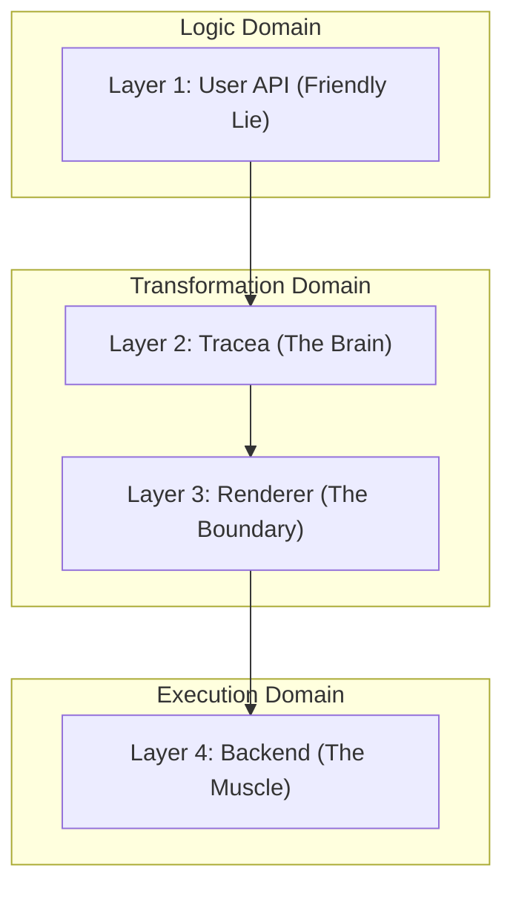

# Architecture: The Dual-Persona Design

Fantasmagorie follows a strict layered architecture designed to isolate user-facing logic from GPU-specific optimizations.

## The Four Layers

### 1. User API (The Friendly Lie)
Located in `src/widgets`, `src/game/sprite.rs`.
Developers interact with **Builders**. These aren't the actual engine objects; they are high-level descriptions of intent. They allow for a clean, readable syntax that feels like writing UI or game logic without worrying about the underlying complexity.

### 2. Tracea (The Brain)
Located in `src/tracea`.
Tracea interprets the "Lie" told by the User API. It optimizes the draw commands, handles compute-based effects (like JFA), and decides how to translate abstract shapes into GPU-executable instructions.

### 3. Renderer (The Boundary)
Located in `src/renderer`.
The Renderer serves as an abstraction layer between Tracea and the physical hardware. It manages frames, swapchains, and camera projections, ensuring that the visual output matches the intended game state.

### 4. Backend (The Muscle)
Located in `src/backend`.
The Backend implements the actual GPU calls. Whether it's Vulkan, OpenGL, or DX12, this layer is responsible for submitting commands, managing pipelines, and handling resource transitions.

## Philosophy: The Friendly Lie vs. The Strict Truth

*   **The Friendly Lie:** You tell the engine "Draw a button with a blue background and a radius of 8". You don't care how it's drawn.
*   **The Strict Truth:** The engine translates this into a set of SDF parameters, a font atlas lookup, a coordinate transformation, and ultimately a series of triangles or compute dispatches.

This separation ensures that the user API remains stable even when the underlying rendering technology changes radically.
