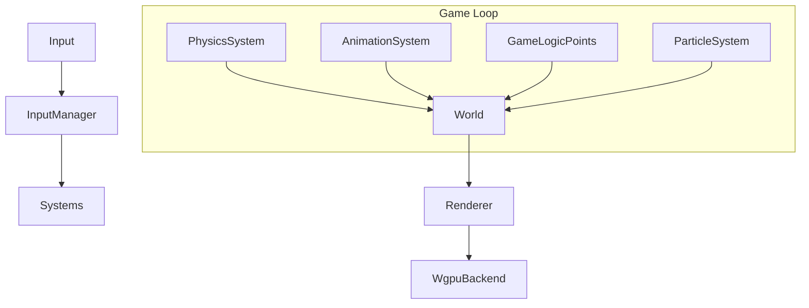

# Architecture Overview

Fantasmagorie uses a data-oriented **Entity Component System (ECS)** architecture, combined with a high-performance **Deferred Rendering** pipeline.

## high-Level Data Flow

```mermaid
graph TD
    Input --> InputManager
    InputManager --> Systems
    
    subgraph "Game Loop"
        PhysicsSystem --> World
        AnimationSystem --> World
        GameLogicPoints --> World
        ParticleSystem --> World
    end
    
    World --> Renderer
    Renderer --> WgpuBackend
```

## 1. The World (ECS)
Located in `src/game/world.rs`.
The `World` struct is the central repository for all game state. It manages:
-   **Entities:** Unique IDs (`EntityId`) representing game objects.
-   **Components:** Data attached to entities (e.g., `Transform`, `Sprite`, `RigidBody`).
-   **Systems:** Logic that iterates over components to update state.

### Key Components
-   `Transform`: Position, rotation, scale, and hierarchy (parent/child).
-   `Sprite`: Texture and color data for rendering.
-   `PhysicsComponent`: Velocity, mass, and restitution.
-   `Collider`: Shape data (Circle, AABB, Polygon).
-   `StateMachine`: logic controller for AI.
-   `AnimationComponent`: Sprite-based frame animation.
-   `SkeletalAnimationComponent`: Bone-based deformations.

## 2. The Renderer
Located in `src/renderer` and `src/backend`.
The rendering engine is decoupled from the game logic. It consumes a read-only snapshot of the World state to produce frames.

### Pipeline Stages
1.  **Geometry Pass:** Renders sprites and meshes into a **G-Buffer** (Albedo, Normal, Emissive).
2.  **Lighting Pass:** Calculates illumination from point lights and emissive surfaces.
3.  **Post-Processing:** Applies cinematic effects:
    -   **Bloom:** Extract bright areas -> Downsample -> Blur -> Upsample -> Mix.
    -   **Tone Mapping:** High Dynamic Range (HDR) -> Low Dynamic Range (LDR).
    -   **Vignette & Grain:** Final aesthetic touches.

## 3. Specialized Subsystems

### Physics
Located in `src/game/physics.rs`.
-   Uses **Separating Axis Theorem (SAT)** for precise collision detection.
-   Resolves collisions via impulse application (changing velocity based on mass/restitution).
-   Optimized with a **Quadtree** for efficient broad-phase queries.

### Audio
Located in `src/audio`.
-   Fire-and-forget SFX system using `cpal`.
-   Calculates stereo panning and volume attenuation based on entity position relative to the camera listener.
-   Uses an object pool for efficient voice management.

### Input
Located in `src/input`.
-   Maps raw hardware inputs (keys, buttons) to abstract **Actions** ("Jump", "Fire").
-   Tracks state (Pressed, Held, Released) for easy logic implementation.
